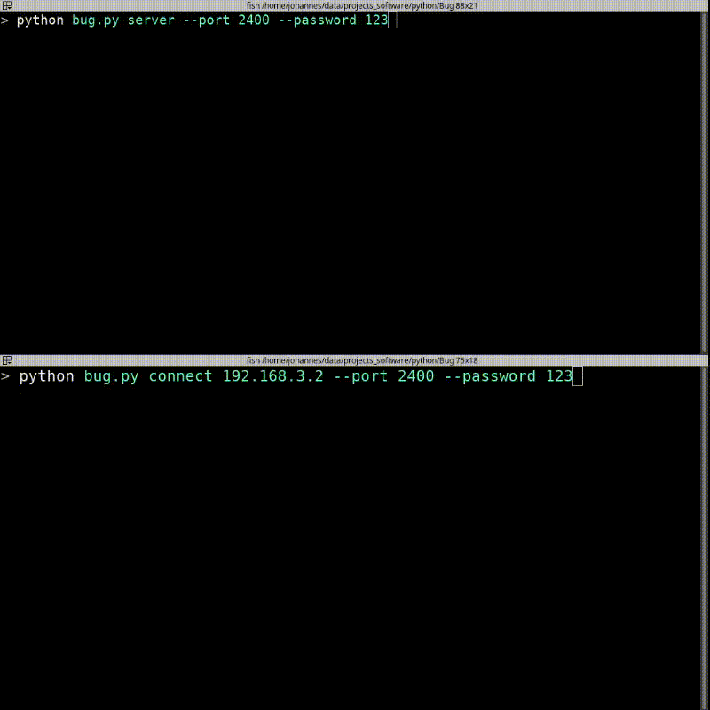

# remote-bug
A program to control a computer remotely via CLI with basic functionality.

```
Usage:
    bug
    bug connect <host> [options]
    bug server [options]
Options:
    -p --port=<PORT>            [default: 4613]
    -P --password=<PASSWORD>    [default: 'NOPW']
    -l --local                  Create a local server
    -h --help                   Display this
```

Once connected use `bughelp` to show available commands:
```
Special Commands:
  shutdown: shutdown the server
  reconnect: reconnect to server
  beep: make a beep sound
  coninfo: display connection info
  bughelp: display this help
  cd: change directory remotely
  exit: terminate client
  cmd: run following string as command, even if special command.
       e.g. cmd shutdown runs the command shutdown remotely
       instead of shutting down the server
  ```
  
Both server and client should run on both Windows and Linux.
  

